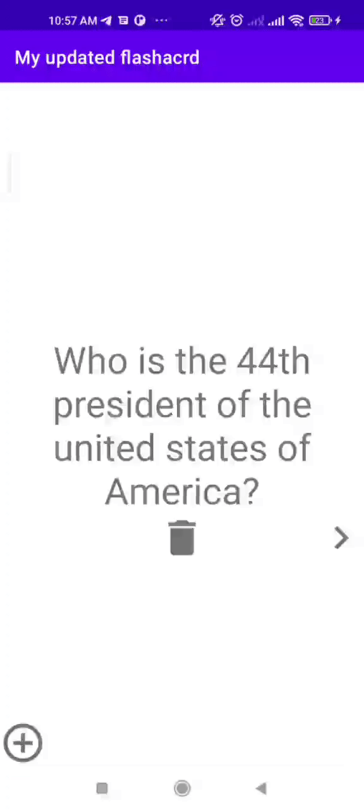
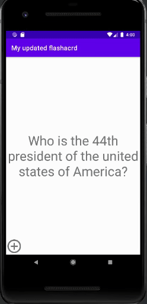

📝 `NOTE` Paste this template at the top of your existing `README.md` file from the last lab.
## Lab 4

### App Description
`TODO://` A flashcard app that displays animation when a flashcard question is clicked.

### App Walk-though
`TODO://` Add the URL to your animated app walk-though `gif` in the image tag below. Make sure the gif actually renders and animates when viewing this README. (☝️ Remove this paragraph after after adding gif)

 

`TODO://` In the User stories section below, add an `x` between the `-[ ]` like this `- [x]` for any user story you complete. (☝️ Remove this paragraph after after checking off user stories)

## Required
- [x] User sees a transition animation when going from the main screen to the add card screen.
- [x] User sees a reveal animation when the flashcard is tapped and the answer is shown
- [x] User sees flashcards animating in / out when the 'next' button is tapped

## Optional
- [ ] Extra styling is added!
- [ ] User sees a countdown timer for each question
- [ ] User sees a 'card flip' animation when the card is tapped
- [ ] User sees a celebration animation with confetti when they answer a question correctly

## Lab 3

### App Description
`TODO://` A flashcard app that allows users to create and save their own flashcard questions

### App Walk-though
`TODO://` Add the URL to your animated app walk-though `gif` in the image tag below. Make sure the gif actually renders and animates when viewing this README. (☝️ Remove this paragraph after after adding gif)

 

`TODO://` In the User stories section below, add an `x` between the `-[ ]` like this `- [x]` for any user story you complete. (☝️ Remove this paragraph after after checking off user stories)

## Required
- [x] User can create a card and still see their created card when the app is relaunched.
- [x] User can create muliple cards and browse through all created cards

## Optional
- [x] User can delete a card and no longer see it in their deck anymore
- [x] Flashcards are shown in random order instead of the order they were created in
- [ ] User can edit a card and see the edit saved when they browse through their deck of cards
- [ ] User can create flashcards with multiple answers and be able to browse through cards with multiple choice answers shown

## FLASHCARD_APP

## Lab 1

### Flashcard_app
`TODO://` An app that displays a flashcard and allows users to ask other users questions
 

## Required
- [x] User can click on a ‘+’ button that takes the user to new ‘Add Card Screen’
- [x] The 'Add Card Screen' has a cancel button to take the user back to the main screen
- [x] User can enter and submit a Question and Answer through the 'Add Card Screen'
- [x] User will see the card they just created on the main screen when they press the 'Save Button'
- [x] Push your progress to GitHub!

## Optional
- [ ] User can edit a card
- [ ] An error message is shown if the user doesn't enter both a Question and an Answer
- [ ] A notification is shown if the card was created successfully
- [ ] User can also enter multiple choice answers when creating a card
- [ ] App is further styled and customized!